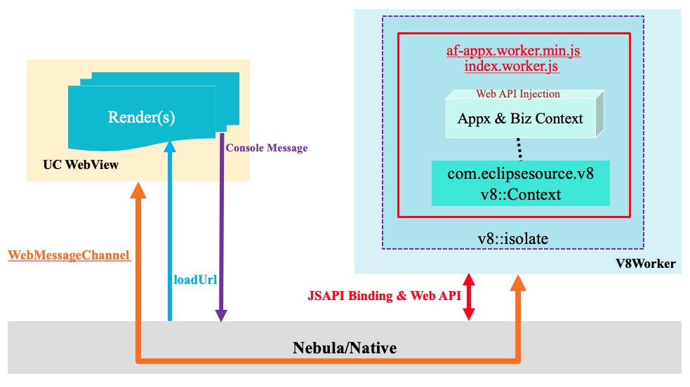

## V8 简介

V8是Google的开源项目，是一个高性能JavaScript和WebAssembly引擎，应用于用于Chrome浏览器、Node.js等项目。学习V8的门槛还是比较高，本章节介绍V8基本概念以便于了解 V8 webworker，以及官方的嵌入式V8的HelloWorld代码，同时给出一些学习链接。

### [嵌入式V8基本概念](https://v8.dev/docs/embed?spm=ata.13261165.0.0.32e6d657XiAJqo)

#### Isolate (隔离)
Isolate和操作系统中进程的概念有些类似。进程是完全相互隔离的，一个进程里有多个线程，同时各个进程之间并不相互共享资源。Isolate 也是一样，Isolate1 和 Isolate2 两个拥有各自堆栈的虚拟机实例，且相互完全隔离。

#### Contexts (上下文)
在 V8 中, 一个 context 就是一个执行环境, 它使得可以在一个 V8 实例中运行相互隔离且无关的 JavaScript 代码. 你必须为你将要执行的 JavaScript 代码显式的指定一个 context.

之所以这样是因为 JavaScript 提供了一些内建的工具函数和对象, 他们可以被 JS 代码所修改. 比如, 如果两个完全无关的 JS 函数都在用同样的方式修改一个 global 对象, 很可能就会出现一个意外的结果.

#### Handle (句柄) 与 垃圾回收
Handle 提供了一个JS 对象在堆内存中的地址的引用. V8 垃圾回收器将回收一个已无法被访问到的对象占用的堆内存空间. 垃圾回收过程中, 回收器通常会将对象在堆内存中进行移动. 当回收器移动对象的同时, 也会将所有相应的 Handle 更新为新的地址.

当一个对象在 JavaScript 中无法被访问到, 并且也没有任何 Handle 引用它, 则这个对象将被当作 "垃圾" 对待. 回收器将不断将所有判定为 "垃圾" 的对象从堆内存中移除. V8 的垃圾回收机制是其性能的关键所在.

Local Handles 保存在一个栈结构中, 当栈的析构函数(destructor)被调用时将同时被销毁. 这些 handle 的生命周期取决于 handle scope (当一个函数被调用的时候, 对应的 handle scope 将被创建). 当一个 handle scope 被销毁时, 如果在它当中的 handle 所引用的对象已无法再被 JavaScript 访问, 或者没有其他的 handle 指向它, 那么这些对象都将在 scope 的销毁过程中被垃圾回收器回收. 入门指南中的例子使用的就是这种 Handle.

Persistent handle 是一个堆内存上分配的 JavaScript 对象的引用, 这点和 local handle 一样. 但它有两个自己的特点, 是对于它们所关联的引用的生命周期管理方面. 当你希望持有一个对象的引用, 并且超出该函数调用的时期或范围时, 或者是该引用的生命周期与 C++ 的作用域不一致时, 就需要使用 persistent handle 了. 例如 Google Chrome 就是使用 persistent handle 引用 DOM 节点. Persistent handle 支持弱引用, 即 PersistentBase::SetWeak, 它可以在其引用的对象只剩下弱引用的时候, 由垃圾回收器出发一个回调.

#### Templates (模板)
在一个 context 中, template 是 JavaScript 函数和对象的一个模型. 你可以使用 template 来将 C++ 函数和数据结构封装在一个 JavaScript 对象中, 这样它就可以被 JS 代码操作. 例如, Chrome 使用 template 将 C++ DOM 节点封装成 JS 对象, 并且将函数安装在 global 命名空间中. 你可以创建一个 template 集合, 在每个创建的 context 中你都可以重复使用它们. 你可以按照你的需求, 创建任意多的 template. 然而在任意一个 context 中, 任意 template 都只能拥有一个实例.

在 JS 中, 函数和对象之间有很强的二元性. 在 C++ 或 Java 中创建一种新的对象类型通常要定义一个类. 而在 JS 中你却要创建一个函数, 并以函数为构造器生成对象实例. JS 对象的内部结构和功能很大程度上是由构造它的函数决定的. 这些也反映在 V8 的 template 的设计中, 因此 V8 有两种类型的 template:

##### FunctionTemplate
一个 Function Template 就是一个 JS 函数的模型. 我们可以在我们指定的 context 下通过调用 template 的 GetFunction 方法来创建一个 JS 函数的实例. 你也可以将一个 C++ 回调与一个当 JS 函数实例执行时被调用的 function template 关联起来.

##### ObjectTemplate
每一个 Function Template 都与一个 Object Template 相关联. 它用来配置以该函数作为构造器而创建的对象.

### Accessors (存取器)
存取器是一个当对象属性被 JS 代码访问的时候计算并返回一个值的 C++ 回调. 存取器是通过 Object Template 的 SetAccessor 方法进行配置的. 该方法接收属性的名称和与其相关联的回调函数, 分别在 JS 读取和写入该属性时触发.

存取器的复杂性源于你所操作的数据的访问方式:

* 访问静态全局变量
* 访问动态变量

### Interceptors (拦截器)
我们可以设置一个回调, 让它在对应对象的任意属性被访问时都会被调用. 这就是 Interceptor. 考虑到效率, 分为两种不同的 interceptor:

* 属性名拦截器: 当通过字符串形式的属性名访问时调用. 比如在浏览器中使用 document.theFormName.elementName 进行访问.
* 属性索引拦截器: 当通过属性的下标/索引访问时调用. 比如在浏览器中使用 document.forms.elements[0] 进行访问.

### Security Model (安全模型)
在 V8 中, 同源被定义为相同的 context. 默认情况下, 是无法访问别的 context 的. 如果一定要这样做, 需要使用安全令牌或安全回调. 安全令牌可以是任意值, 但通常来说是个唯一的规范字符串. 当建立一个 context 时, 我们可以通过 SetSecurityToken 来指定一个安全令牌, 否则 V8 将自动为该 context 生成一个.

### HelloWorld
结合上述嵌入式V8的基本概念，能大致理解V8 [Hello World example](https://chromium.googlesource.com/v8/v8/+/branch-heads/6.8/samples/hello-world.cc?spm=ata.13261165.0.0.32e6d657XiAJqo&file=hello-world.cc)就不影响对V8 Worker的理解了。

### 学习资料
[官方文档](https://v8.dev/docs?spm=ata.13261165.0.0.32e6d657XiAJqo)
[Ignition: An Interpreter for V8   ](https://docs.google.com/presentation/d/1OqjVqRhtwlKeKfvMdX6HaCIu9wpZsrzqpIVIwQSuiXQ/edit?spm=ata.13261165.0.0.32e6d657XiAJqo#slide=id.ge4ef702cb_2_67)
[Ignition: Jump-starting an Interpreter for V8](https://docs.google.com/presentation/d/1HgDDXBYqCJNasBKBDf9szap1j4q4wnSHhOYpaNy5mHU/edit?spm=ata.13261165.0.0.32e6d657XiAJqo#slide=id.g1357e6d1a4_0_58)
[V8: Hooking up the Ignition to the Turbofan](https://docs.google.com/presentation/d/1chhN90uB8yPaIhx_h2M3lPyxPgdPmkADqSNAoXYQiVE/edit?spm=ata.13261165.0.0.32e6d657XiAJqo#slide=id.g1357e6d1a4_0_58)
[Code caching](https://v8.dev/blog/code-caching?spm=ata.13261165.0.0.32e6d657XiAJqo)

## V8 Worker工程结构
小程序容器属于是Java工程，V8引擎是C++编写，因此容器要使用V8引擎就需要JNI来调用。于是就引入了J2V8，J2V8是对V8引擎的JAVA封装，属于eclipse开源项目。J2V8内部完成了JS数据结构和Java数据结构绑定，抽象并屏蔽了C++侧Handle、Scope、Tempates等概念，大大简化了Java工程接入V8引擎成本。同时J2V8非常注重性能和内存消耗。

  

### Render部分JSAPI流程
如上图所示，Render和Nebula直接的双向通行是分别通过Console.log和WebView的loadUrl接口进行的。

#### 容器到Render
容器要加载运行Render部分的JS脚本，都是通过WebView的loadUrl进行；WebView在运行Render部分的JS脚本（af-appx.min.js和index.js）之前，需要提前注入APPX框架需要用到的全局JS对象，如window.AlipayJSBridge等，供JSAPI调用使用。

#### Render到容器
Render侧到容器的JSAPI的调用，本质上是通过Console.log Web API实现

### Worker部分JSAPI流程

#### Worker到容器
类似于Render部分，在初始化V8 Worker时，也需要在V8 Worker环境中注入JSBridge这个全局JS对象，JSBridge的定义在workerjs_v8_origin.js中。
​同时，我们已经在V8 Worker环境中提前注入了nativeFlushQueue API，同时绑定了这个API的JAVA侧回调；
这样Worker部分JSAPI 通过AlipayJSBridge.call()调用，最终会回调到容器侧的AsyncJsapiCallback()。类似的，在AsyncJsapiCallback()中，会进行JSAPI的权限校验，同时分发到具体的JSAPI实现。

#### 容器到Worker
JSAPI在容器侧处理完成之后，如果有返回结果，将会返回到Worker。

### Render和Worker通信
Render和Worker的通信使用[MessageChannel](https://developer.mozilla.org/en-US/docs/Web/API/MessageChannel?spm=ata.13261165.0.0.32e6d657XiAJqo)

### 单V8 Context结构
在V8 Worker的初期，一个小程序占用一个V8 Isolate，一个V8 Isolate只创建一个V8 Context。也就是小程序的前端框架APPX的代码 appx.worker.min.js和小程序的业务代码index.worker.js运行于同一个V8 Isolate上的同一个V8 Context上。这样的设计就会存在JS安全性问题，业务JS代码可以通过拼接冒名的形式访问到为APPX注入的内部JS对象和内部JSAPI，在同一个V8 Context中，是无法隔离开业务JS代码和APPX框架JS代码的运行环境的。后面我们会介绍如何解决这个安全问题。
