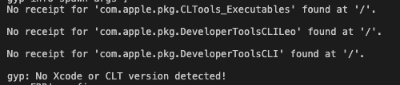
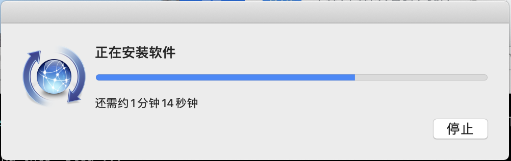

## 问题原因
当项目中依赖 `mozjpeg` 这个依赖，安装是会报如下错误
<div class="Image__Small">
  
</div>

```shell
gyp: No Xcode or CLT version detected!
gyp ERR! configure error
```
虽然本机已经安装过 comman line tools ，怀疑是因为系统版本升级到 catalina 导致，所以解决方案是把旧的删掉，重新装

## 解决方案

### 寻找到旧的安装地址

```shell
xcode-select --print-path
```
如果没有以为，预期结果为 `/Library/Developer/CommandLineTools`
执行删除

```shell
sudo rm -r -f /Library/Developer/CommandLineTools
```

### 安装

```shell
xcode-select --install
```
执行期间会让你输入秘密，按提示操作即可

<div class="Image__Small">
  
</div>